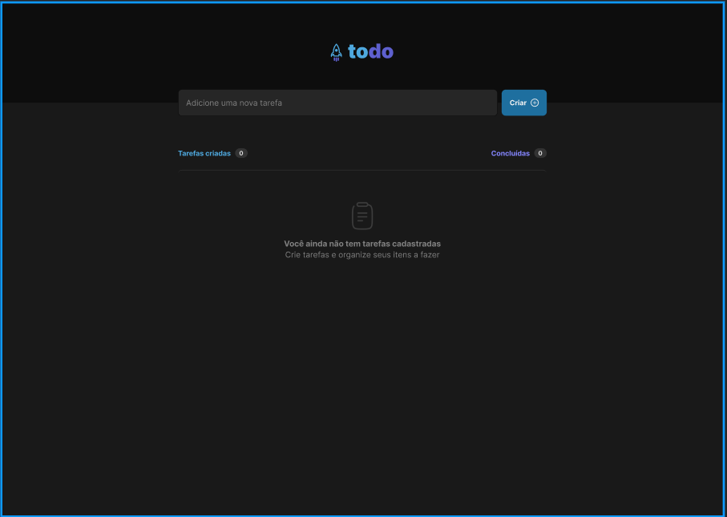
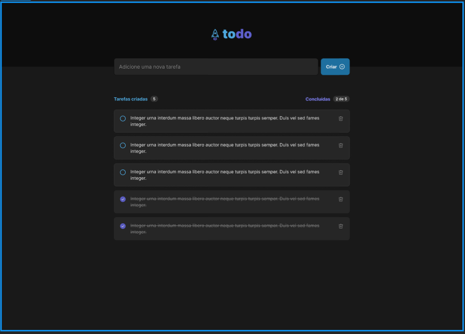

<h1>Projeto to-do list</h1>

<h2>contém as seguintes funcionalidades:</h2>

- Adicionar uma nova tarefa
- Marcar e desmarcar uma tarefa como concluída
- Remover uma tarefa da listagem
- Mostrar o progresso de conclusão das tarefas

Utilizei apenas o React neste projeto que é bem desafiador.

Neste todo list, temos o seguinte:

- Uma listade tarefas.
- Opção de marcar e desmarcar uma tarefa concluída.
- Remover uma tarefa da lista.
- Mostra quantas tarefas temos e quantas já foram resolvidas.

<h3>Desafios que encontrei nesse projeto</h3>

- Deletar uma tarefa(task).
Porque tive que aprofundar os meus conhecimentos no evnto de onClick do button.
Com isso, tive que fazer vários testes até acertar.

- Compartilhar funções entre os componentes, porque nem no React usamos pequenos
fragmentos para compor o projeto.

- Capturar o evento de input no caso(e.target.value) e armazenar em um array, porque
iremos ter mas de uma tarefa para realizar.

- Deixar o layout mas próximo possível do desafio. Tive vários aprendizados com o CSS
que é para mim um pouco desafiador neste momento.

- Utilizar o if else dentro das tag HTML. Porque tenho que usar {} chaves para que o
código Javascript seja reconhecido pelo React e executado também. No caso só utilizei o
ternary operator que foi um desafio, mas conseguir fazer.

<h3>Imagem do projeto todo list</h3>

# projeto-todo-list-reactjs
